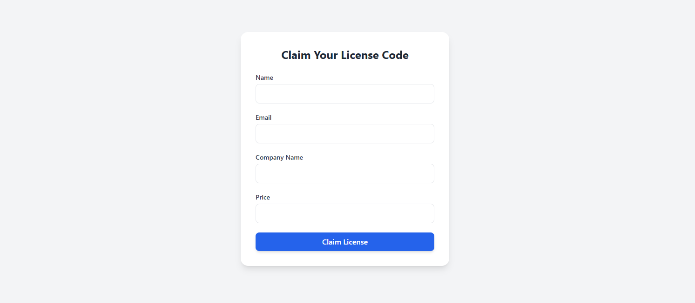
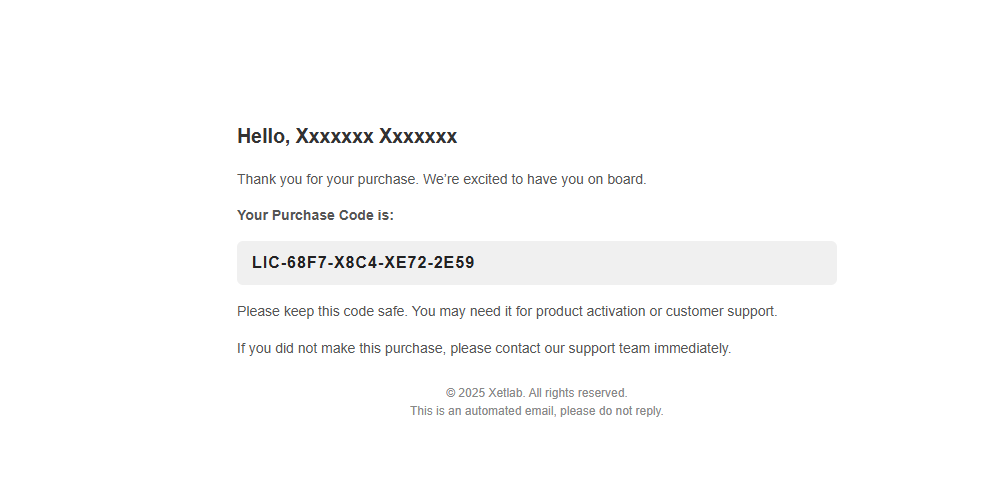

# License Server (Laravel)

A simple **license code generation and verification server** built with Laravel.  
This project provides an API and basic UI for claiming purchase/license codes, sending them via email, and verifying them from client applications.

---

## 🚀 Features

- 🎟️ **Claim License**: Generate a unique license code by submitting name, email, and company info.
- 📧 **Email Delivery**: Send license codes automatically to buyer’s email (configurable via `.env`).
- ✅ **Verify License**: Check validity, status, support period, and activation count of a license.
- 📊 **Activation Control**: Support for limiting max activations per license.
- 🛡️ **Throttling**: API routes protected with request throttling.
- 🗄️ **Database-backed**: Stores licenses with meta info (price, company, support_until, etc.).
- 🧩 **Extensible**: Can be integrated into SaaS apps, digital products, or software distribution systems.

---

## 🛠️ Requirements

- PHP >= 8.1  
- Laravel >= 10 (tested with Laravel 12)  
- MySQL/MariaDB or any supported database  
- Composer  
- (Optional) Mail service (SMTP/Gmail/Mailpit/Mailtrap)

---

## ⚙️ Installation

1. Clone the repo:
   ```bash
   git clone https://github.com/esteham/license-server.git
   cd license-server
    ```

2. Install dependencies:

   ```bash
   composer install
   ```

3. Copy `.env`:

   ```bash
   cp .env.example .env
   ```

4. Set up your database in `.env`, then run migrations:

   ```bash
   php artisan migrate
   ```

5. Configure mail settings in `.env` (choose Gmail, Mailtrap, or Mailpit).

6. Start the server:

   ```bash
   php artisan serve
   ```

---

## 🔑 API Endpoints

### Claim License

* **POST** `/api/claim`
* Params:

  * `name` (string, required)
  * `email` (string, required)
  * `company` (string, optional)
  * `price` (numeric, optional)

### Verify License

* **GET** `/api/verify`
* Params:

  * `purchase_code` (string, required)
  * `domain` (string, optional)
  * `app_url` (string, optional)

---

## 📧 Email Template

* Responsive HTML email is included (`resources/views/emails/license.blade.php`).
* Contains buyer name, license code, and support message.

---

## 📸 Screenshots

*Form for claiming license code:*


*Sample email with license code:*


---

## 📜 License

This project is open-source and available under the [MIT License](LICENSE).

```
